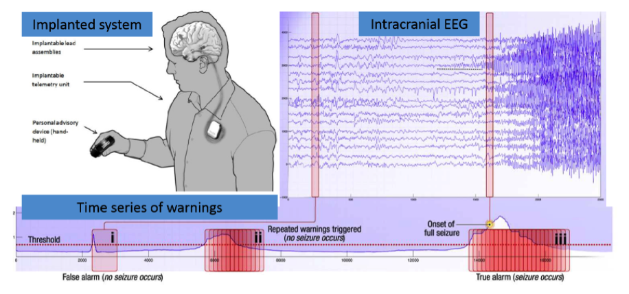

# Melbourne University AES/MathWorks/NIH Seizure Prediction

La epilepsia afecta a cerca del 1% de la población mundial y está caracterizada por la ocurrencia de convulsiones repentinas. Para la mayoría de los pacientes es suficiente proporcionarles una alta dosis de medicamentos anticonvulsivos para prevenir esta crisis, sin embargo por esta misma razón es que frecuentemente sufren de esfectos secundarios. Entre el 20 y 40 por ciento de los pacientes con epilepsia, los medicamentos no son efectivos.

Los sistemas de prediccción de convulsiones tienen el potencial de auxiliar a los pacientes con epilepsia a tener una mejor calidad de vida. En base a la actividad electrica del cerebro (EEG), un algoritmo efectivo debería de predecir con alto grado de probabilidad la ocurrencia de las convulsiones, por lo tanto se pueden diseñar dispositivos que adviertan al usuario y así evitar actividades peligrosas y administrar la dosis de medicamente adecuada.

### Background

Existe nueva evidencia de que la actividad dinamica temporal del cerebro puede ser clasificada en 4 clases: Preictal, Interictal, Ictal y Post-ictal. Los sistemas de predicción deben de ser capaces de identificar un estado preictal que puede ser diferenciado de los demás estados, de esta manera se podría prevenir la convulsión. 

Actividad del cerebro humano fue guardada en la forma de EEG intracranial, lo que involucra electrodos posicionados en la superficie de la corteza cerebral capturando las señales electricas con un sistema de monitoreo.

### Dataset

Los datos están organizados en carpetas contenedoras de datos de entrenamiento y de pruebas por cada paciente. Para esta primera parte se selecciono la carpeta train_1 de datos de entrenammiento organizada en archivos nombrados de la siguiente manera.

i_j_k.mat - El j-ésimo segmento de datos correspondiente a la k clase (k = 0 para interictal, k = 1 para preictal) para el i-ésimo paciente.

Y dentro de este archivo .mat encontraremos lo siguiente: 

data: Una matriz de muestra de valores iEEG ordenada fila y columna como muestra y electrodo respectivamente.
nSamplesSegment: Número total de muestras (columnas).
iEEGsamplingRate: Tasa de muestreo de datos, es decir, el número de muestras de datos que representan 1 segundo de los EEG.
channelIndices: Un arreglo de índices correspondiente a las columnas en data.
sequence: El índice del segmento de datos dentro de la serie de una hora de clips.

